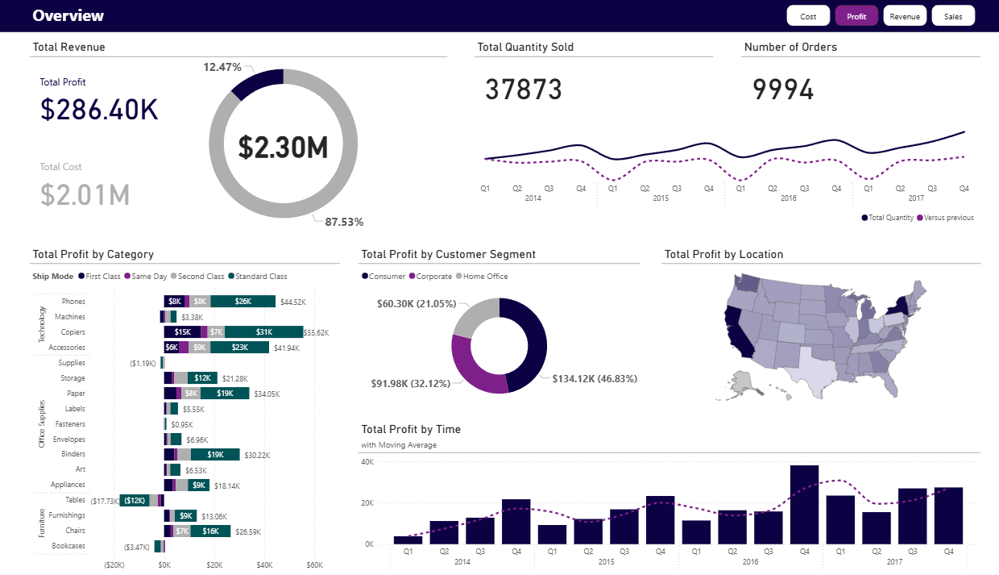
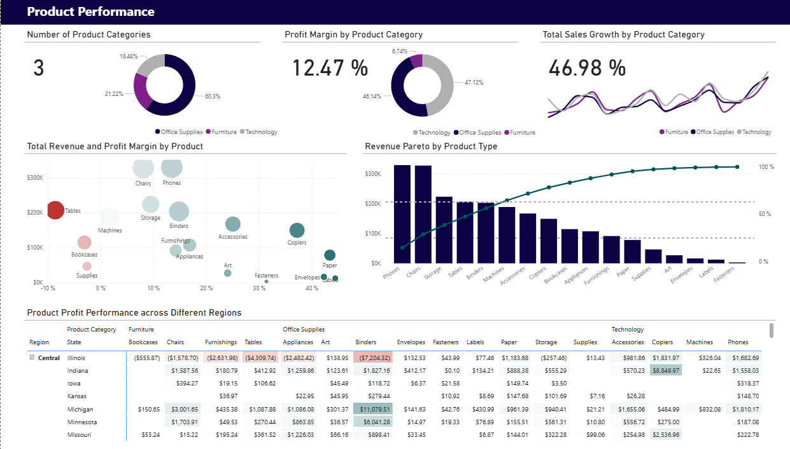

# Superstore Power BI Dashboard
Interactive analytics on the Kaggle *Superstore Dataset (Final)* (2014–2017).

## What's inside
- 3 pages: Overview, Sales Analysis, Product Performance.
- Star schema model + key DAX.

## How to view
- Download `Superstore_Insights.pbix` and open in Power BI Desktop.

## Data source
See [DATA_SOURCE.md](./DATA_SOURCE.md).

## Screenshots

